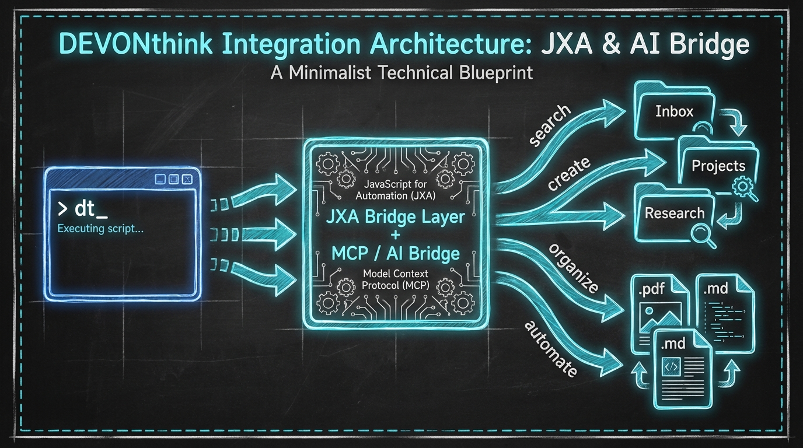

# DEVONthink MCP & CLI (dt)



(unofficial) **The Intelligent Bridge for DEVONthink 4 on macOS.**

`dt` is a high-performance command-line interface and Model Context Protocol (MCP) server that turns your DEVONthink databases into a first-class citizen for AI agents and professional automation.

---

## 💡 The Problem

DEVONthink is the most powerful personal information manager for macOS, but it has historically been an "offline fortress."
1. **The Scripting Gap:** AppleScript and JXA are powerful but have high execution overhead and a steep learning curve for modern workflows.
2. **The AI Isolation:** Modern Large Language Models (LLMs) like Claude or GPT cannot "see" into your local DEVONthink database without manual copy-pasting, losing the benefit of your curated knowledge.
3. **The Batch Penalty:** Running hundreds of individual commands via standard scripts causes significant performance lag due to repeated process initialization.

## 🚀 The Solution: The Intelligent Bridge

`dt` solves these problems by providing a unified, state-aware bridge between your local data and the world of AI agents.

### Evolution of the Project
- **v1.0 (The CLI):** A simple JXA wrapper to make terminal-based searching and record creation fast and predictable.
- **v2.0 (The MCP Server):** Addition of the **Model Context Protocol**, allowing AI agents (like Claude Desktop) to natively search, read, and organize your databases as if they were part of the AI's own memory.
- **v2.2 (The Intelligent Bridge):** Introduction of **Session State**, **Look-Ahead Batching**, and **AI-Powered Queue Repair**. The system now understands *context*, bundles operations for 90% faster execution, and can self-heal failed tasks using DEVONthink's internal AI.

## 🧠 Why this project? (Built-in AI vs. `dt`)

DEVONthink 4 includes impressive built-in AI features, so why use `dt`?

| Feature | DEVONthink 4 Built-in | DEVONthink CLI (`dt`) |
| :--- | :--- | :--- |
| **Focus** | Human-in-the-loop GUI assistance. | Headless, agent-native automation. |
| **Connectivity** | Local app only. | Connects to Claude, GPT, and CLI pipelines. |
| **Batching** | Manual selection or complex scripts. | Automatic **Look-Ahead Optimization**. |
| **Verification** | Visual check only. | **Programmatic & AI-assisted** resource repair. |

---

## 🤖 AI Integration (MCP)
This tool includes a **Model Context Protocol (MCP)** server. When added to Claude Desktop, it allows the AI to:
- **Research:** "Find all my notes on quantum computing from last month."
- **Summarize:** "Read the selected document and give me a 3-bullet summary."
- **Organize:** "Move these 50 PDFs to the correct folders and tag them based on their content."

👉 **[Setup Guide (MCP.md)](MCP.md)** | 👉 **[Batch System Guide (docs/BATCH-QUEUE.md)](docs/BATCH-QUEUE.md)**
| 👉 **[Search Cheatsheet (docs/SEARCH-CHEATSHEET.md)](docs/SEARCH-CHEATSHEET.md)**

---

## 🛠 Installation

```bash
# Clone or download this repository
cd devonthink-mcp-cli

# Install dependencies
npm install

# Link globally (optional, makes 'dt' available everywhere)
npm link
```

## ⚡ Quick Start

```bash
# Check if DEVONthink is running
dt status

# Search for records and get clean output
dt search query "machine learning" --database "Research"

# Time-bound search (first-class flags)
dt search query "machine learning" --created-after "2 weeks" --modified-before "2024-12-31"

# Get selected records from the GUI
dt get selection

# Add a task to the queue for later execution
dt move <uuid> --to /Archive --queue

# Verify the queue exists and fix errors with AI
dt queue verify
dt queue repair --apply

# Execute the optimized batch
dt queue execute
```

## 📖 Key Commands

### Organization & AI
- `dt organize <uuid> --auto`: OCR, rename, tag, and summarize a record in one step.
- `dt summarize <uuid>`: Generate intelligent summaries (Native or AI-powered).
- `dt chat "question"`: Chat with your documents using any AI engine.

### Management
- `dt search`: High-speed full-text, tag, URL, or metadata search.
- `dt get`: Retrieve props, text content, selection, or concordance.
- `dt create`: Create records, markdown from URLs, or AI-generated images.
- `dt tags`: Advanced tag normalization, merging, and deduplication.

### Batch & Queue
- `dt queue add`: Add tasks to the persistent queue.
- `dt queue status`: View pending and completed tasks.
- `dt queue execute`: Run bundled, optimized operations.

---

## 🏗 Architecture

`dt` wraps specialized JXA (JavaScript for Automation) scripts with a Node.js orchestration layer.
- **`src/queue.js`**: Handles the Look-Ahead Bundler for high-speed batching.
- **`src/state.js`**: Tracks session context (recent records/groups).
- **`jxa/`**: Direct AppleScript bridge for reading and writing data.

---

## 📄 License
MIT

**Created by [Ian Shen (2b3pro)](https://github.com/2b3pro)**
**2B3 PRODUCTIONS LLC**

[Buy me a coffee ☕️!](https://paypal.me/2b3/5)
