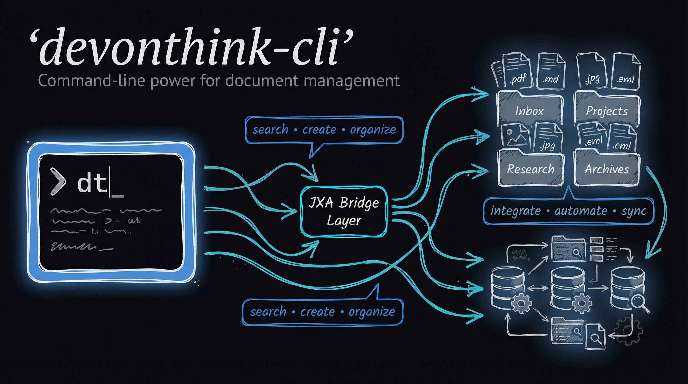

# DEVONthink MCP & CLI (dt)



A unified command-line interface for DEVONthink 4 on macOS.

## Requirements

- macOS (DEVONthink only runs on macOS)
- Node.js 18 or later
- DEVONthink 4 installed and running

## 🤖 AI Integration (MCP)
This tool includes a **Model Context Protocol (MCP)** server, allowing **Claude Desktop** to search and read your DEVONthink database directly.
👉 **[Read the Setup Guide (MCP.md)](MCP.md)**

## Installation

```bash
# Clone or download this repository
cd devonthink-cli

# Install dependencies
npm install

# Link globally (optional, makes 'dt' available everywhere)
npm link
```

## Quick Start

```bash
# Check if DEVONthink is running
dt status

# Search for records
dt search query "machine learning" --database "Research"

# Get selected records from DEVONthink
dt get selection

# List inbox items
dt list inbox --limit 10

# Create a new markdown note
dt create record --name "My Note" --type markdown --database "Inbox" --content "# Hello"

# Import a file
dt import ~/Documents/paper.pdf --database "Research" --to "/Papers/2024"
```

## Commands

### Search

```bash
# Full-text search
dt search query "AI" --database "Research" --type pdf --limit 20

# Search by filename
dt search file "report" --database "Work"

# Search by path
dt search path "/Projects/2024"

# Search by tags
dt search tags "important,review" --database "Inbox"

# Search by URL
dt search url "github.com"

# Search by comment
dt search comment "follow up"

# Search by content hash
dt search hash "abc123..."

# Open search in DEVONthink window
dt search show "query" --database "Research"
```

### Get Record Information

```bash
# Get all properties of a record
dt get props <uuid>

# Get plain text content/preview
dt get preview <uuid> --length 5000

# Get currently selected records in DEVONthink
dt get selection

# Get word concordance (word frequency list)
dt get concordance <uuid>

# Get a specific custom metadata field
dt get metadata <uuid> <field>

# List all custom metadata fields for a record
dt get metadata-list <uuid>
```

### Transcribe

```bash
# Transcribe speech/text from audio/video/image
dt transcribe <uuid>
dt tr <uuid>  # alias

# With language and no timestamps
dt transcribe <uuid> --language en --no-timestamps

# Use AI to clean up transcription (fix grammar, formatting)
dt transcribe <uuid> --ai-cleanup

# Custom AI prompt
dt transcribe <uuid> --ai-prompt "Format as bullet points"

# AI cleanup without keeping raw transcription
dt transcribe <uuid> --ai-cleanup --no-raw

# Just output the cleaned text
dt transcribe <uuid> --ai-cleanup --no-raw --quiet

# Save transcription as markdown document (defaults to source location)
dt transcribe <uuid> --save

# Save to specific database and group with custom name
dt transcribe <uuid> --save -d "Notes" -g "/Transcripts" -n "Meeting Notes"

# Save with tags
dt transcribe <uuid> --save -t transcript -t meeting
```

### List Records

```bash
# List contents of a group (by UUID)
dt list group <uuid>

# List contents of a group (by database/path)
dt list group "Database Name" "/Path/To/Group"

# List inbox items
dt list inbox --limit 20 --folder "_TO BE FILED"

# List records by tag
dt list tag "important" --database "Inbox"

# List with previews
dt list inbox --preview 3000
```

### Create Records

```bash
# Create a record with properties
dt create record --name "Title" --type markdown --database "Inbox" --content "# Content"

# Create from file content
dt create record --name "Note" --type txt --database "Inbox" --file ./notes.txt

# Create a bookmark (via record command)
dt create record --name "Example" --type bookmark --database "Inbox" --url "https://example.com"

# Create a bookmark (dedicated command)
dt create bookmark "https://example.com" --name "Example" --database "Inbox"
dt create bm "file:///Users/me/Documents" --name "My Docs" --database "Inbox"

# Create a group/folder
dt create record --name "New Folder" --type group --database "Research" --group "/Projects"

# Create with tags
dt create record --name "Note" --type markdown --database "Inbox" -t "important" -t "review"

# Create Markdown from web URL (with tags)
dt create markdown "https://example.com/article" --database "Research" -t article -t web

# Create PDF from web URL (with tags)
dt create pdf "https://example.com/page" --database "Archive" -t archive

# Create web document from URL (with tags)
dt create web "https://example.com" --database "Web" -t reference

# Generate AI image from prompt (with tags)
dt create image "a sunset over mountains" --name "Sunset" --database "Images" --engine dalle3 -t ai-generated
```

> **Note:** All `create` commands support the `-t, --tag` option for adding tags at creation time.

### Import & Index

```bash
# Import a file (copies into database)
dt import ~/Documents/paper.pdf --database "Research"

# Import with custom name and destination
dt import ./document.pdf --database "Research" --to "/Papers/2024" --as "Important Paper"

# Import with OCR
dt import ./scan.pdf --database "Archive" --ocr --ocr-type pdf

# Import and transcribe audio/video (creates markdown with transcription)
dt import ./recording.mp3 --database "Notes" --transcribe
dt import ./interview.mp4 --database "Archive" --transcribe --language en --timestamps

# Index external file/folder (creates reference, doesn't copy)
dt index ~/Projects/code --database "Development"
```

### Export & Deconsolidate

```bash
# Export record to filesystem
dt export <uuid> --to ~/Desktop/Export

# Export without metadata
dt export <uuid> --to ~/Desktop --no-metadata

# Move internal record to external folder (deconsolidate)
dt deconsolidate <uuid>
dt deconsolidate <uuid> --to ~/Documents/External
```

### Modify Records

```bash
# Rename a record
dt modify <uuid> --name "New Title"

# Add tags
dt modify <uuid> --add-tag "important" --add-tag "review"

# Remove tags
dt modify <uuid> --remove-tag "old-tag"

# Replace all tags
dt modify <uuid> --set-tags "new" "fresh" "updated"

# Set comment
dt modify <uuid> --comment "This is a note about this record"

# Set custom metadata
dt modify <uuid> --meta "author=John Doe" --meta "year=2024"
```

### Intelligent Organization (AI Librarian)

Clean up messy databases by automatically performing OCR, renaming, tagging, and summarizing records based on their content.

```bash
# Fully automate organization (OCR + Rename + Tag + Summarize)
dt organize <uuid> --auto

# Process everything in the Inbox
dt list inbox -q | dt organize - --auto

# Specific tasks
dt organize <uuid> --rename     # Suggest professional title
dt organize <uuid> --tag        # Suggest semantic tags
dt organize <uuid> --summarize  # Add summary to record comment
dt organize <uuid> --ocr        # Perform OCR if text is missing
dt organize <uuid> --prompt <uuid> # Use custom instructions from a record

# Set a global default prompt for organization
export DT_ORGANIZE_PROMPT="ABC-123-DEF"
```

### AI Summarization

Generate concise summaries using a specialized prompt or global SOP.

```bash
# Summarize a record and save to its comment
dt summarize <uuid>

# Just print the summary to terminal
dt summarize <uuid> --print

# Use a specific summarization SOP
dt summarize <uuid> --prompt <uuid>

# Native summarization (extract highlights to markdown)
dt summarize <uuid> --native --type annotations --format markdown

# Native content summarization
dt summarize <uuid> --native --type content --format rich

# Set a global default summarization prompt
export DT_SUMMARIZE_PROMPT="GHI-789-JKL"
```

### Update Content

```bash
# Update text content of a record
dt update <uuid> --content "New content here"

# Update from file
dt update <uuid> --file ./updated-content.md

# Append to existing content
dt update <uuid> --content "Additional text" --mode appending

# Insert after first line
dt update <uuid> --content "Inserted text" --mode inserting

# Update the comment property
dt update <uuid> --content "Comment text" --comments

# Update a custom metadata field
dt update <uuid> --content "John Doe" --custom-metadata author

# Update via stdin
echo "Content from pipe" | dt update <uuid> -c -
```

### Move, Duplicate, Replicate

```bash
# Move record to another group
dt move <uuid> --to <destination-uuid>
dt move <uuid> --to "/New/Location" --database "Work"

# Duplicate record (independent copy)
dt duplicate <uuid> --to <destination-uuid>

# Replicate record (linked copy)
dt replicate <uuid> --to <destination-uuid>

# Replicate to multiple groups
dt replicate <uuid> --to <uuid1> <uuid2> <uuid3>
```

### Merge Records

```bash
# Merge multiple records into one (RTF/PDF)
dt merge <uuid1> <uuid2> <uuid3>

# Merge into specific group
dt merge <uuid1> <uuid2> --to "/Merged" --database "Archive"
```

### Linking & Relations

```bash
# Explore relationships (Backlinks, Outgoing links, and AI "See Also")
dt get related <uuid>

# Filter relations by type
dt get related <uuid> --type incoming  # Backlinks only
dt get related <uuid> --type similar   # AI suggestions only

# Manually link two records (appends markdown link to source)
dt link <source-uuid> <target-uuid>

# Enable magic linking features for a record
dt link <uuid> --wiki --see-also

# Disable magic linking features
dt unlink <uuid> --wiki --see-also

# Configure specific visibility flags
dt link <uuid> --no-search --no-chat  # Hide from search and AI
```

### Delete Records

```bash
# Delete (move to trash)
dt delete <uuid>

# Aliases
dt rm <uuid>
dt trash <uuid>
```

### Convert Records

```bash
# Convert record to another format
dt convert <uuid> --format pdf
dt convert <uuid> --format markdown
dt convert <uuid> --format rtf
```

### AI Chat

```bash
# Simple prompt
dt chat "What is the capital of France?"

# With document context
dt chat "Summarize this document" -r <uuid>

# Use record content as the prompt
dt chat -P <uuid>

# Combine prompt text with record content (text prepended to record)
dt chat "Summarize this document:" -P <uuid>

# Multiple documents for context
dt chat "Compare these documents" -r <uuid1> -r <uuid2>

# With web URL context
dt chat "Summarize this article" --url https://example.com/article

# Pipeline: search → chat
dt search query "quarterly reports" -q | dt chat "What are the key trends?" --record -

# Prompt from stdin
echo "Explain quantum computing" | dt chat

# Specific engine and model
dt chat "Explain this code" -r <uuid> -e claude -m "claude-3-sonnet"

# JSON response format
dt chat "List 5 facts about Mars" -f json

# Disable reasoning for speed/cost
dt chat "Quick summary" -r <uuid> --no-thinking

# List available models
dt chat models
dt chat models -e claude
dt chat models -e ollama -q  # Just model names

# Get model capabilities
dt chat capabilities -e claude -m "claude-3-opus"
```

**Engines:** chatgpt, claude, gemini, mistral, perplexity, openrouter, openai-compatible, lmstudio, ollama, remote-ollama

**Options:**
- `-r, --record <uuid>` - Document(s) for context (repeatable)
- `-P, --prompt-record <uuid>` - Use record content as prompt
- `-U, --url <url>` - Web page/image/PDF URL for context
- `-e, --engine <engine>` - Chat engine
- `-m, --model <model>` - Specific model name
- `-T, --temperature <0-2>` - Creativity (0=focused, 2=random)
- `--role <text>` - System role/persona
- `--mode <mode>` - Content mode: auto, text, vision
- `-u, --usage <mode>` - Usage mode: cheapest, auto, best
- `-f, --format <fmt>` - Response format: text, json, html, message, raw
- `--no-thinking` - Disable reasoning (faster/cheaper)
- `--no-tools` - Disable tool calls (no search/download)

### Classification

```bash
# Get classification proposals
dt classify suggest <uuid>

# Get proposals for specific database
dt classify suggest <uuid> --database "Research"

# Batch classify multiple records
dt classify batch --input '[{"uuid":"...","database":"...","groupPath":"/..."}]'
```

### Group Management

```bash
# Resolve or create a group path (with fuzzy matching)
dt group "/Authors/SMITH, John" --database "Research"

# Alias
dt mkdir "/New/Path/Here" --database "Inbox"
```

### Download Operations

```bash
# Add URL to download manager queue
dt download add "https://example.com/file.pdf" --database "Downloads"

# Download URL content directly
dt download url "https://example.com/page"

# Download HTML/XML markup
dt download markup "https://example.com/page"

# Download JSON from URL
dt download json "https://api.example.com/data"

# Start/stop download manager
dt download start
dt download stop
```

### Reading List

```bash
# Add record to reading list
dt reading-list add <uuid>

# Add URL to reading list
dt reading-list add --url "https://example.com/article"
```

### Reveal in DEVONthink

```bash
# Open record in new window
dt reveal <uuid>

# Open in new tab
dt reveal <uuid> --mode tab

# Navigate in-place (frontmost window)
dt reveal <uuid> --mode reveal

# Show parent group
dt reveal <uuid> --parent

# Aliases
dt open <uuid>
dt show <uuid>
```

### Batch Operations

```bash
# Get previews for multiple records
dt batch preview --uuids <uuid1> <uuid2> <uuid3> --length 3000

# Verify records after operations
dt batch verify --uuids <uuid1> <uuid2> <uuid3>
```

### Status

```bash
# Check if DEVONthink is running
dt status

# Quiet mode (exit code only: 0=running, 1=not running)
dt status --quiet
```

## Output Options

All commands support these output options:

- `--json` - Output compact JSON
- `--pretty` - Output pretty-printed JSON (default for most commands)
- `-q, --quiet` - Minimal output (often just UUIDs)

## Shell Completions

```bash
# Generate Bash completions
dt completion bash >> ~/.bashrc

# Generate Zsh completions
dt completion zsh > ~/.zsh/completions/_dt

# Generate Fish completions
dt completion fish > ~/.config/fish/completions/dt.fish
```

## UUID References

Commands accepting UUIDs also accept DEVONthink item URLs:

```bash
# Both formats work
dt get props ABC123-DEF456
dt get props "x-devonthink-item://ABC123-DEF456"
```

## Stdin Piping Support

Several commands support reading from stdin using `-` as a placeholder, enabling powerful shell pipelines.

### Content from Stdin

```bash
# Create record with content piped from stdin
echo "# My Note" | dt create record -n "Note" -T markdown -d "Inbox" -c -

# Update record with content from stdin
cat updated.md | dt update <uuid> -m setting -c -

# Pipe content from another command
curl -s https://api.example.com/data | dt create record -n "API Data" -T txt -d "Inbox" -c -
```

### UUIDs from Stdin

```bash
# Move records from search results
dt search query "old project" -q | dt move - -t <archive-group-uuid>

# Delete multiple records
dt search tags "temp" -q | dt delete -

# Batch preview from list
dt list inbox -q | dt batch preview -u -

# Batch verify from search
dt search query "recent" -q | dt batch verify -u -
```

### Pipeline Examples

```bash
# Search, filter, and move in one pipeline
dt search query "2023" -q | head -10 | dt move - -t <archive-uuid>

# Process search results with jq and pipe to batch
dt search tags "review" --json | jq -r '.results[].uuid' | dt batch preview -u -

# Chain with x-devonthink-item:// URLs
echo "x-devonthink-item://ABC123-DEF456" | dt move - -t <group-uuid>
```

## Testing

The CLI includes a comprehensive test suite using Node.js native test runner.

### Running Tests

```bash
# Run all tests
npm test

# Run tests with verbose output
npm test -- --test-reporter=spec
```

### Test Database

Tests require a DEVONthink database named "Test_Database" to be open. The test suite includes 74 tests covering all major commands:

- Status checks
- Get operations (props, preview, selection, concordance, metadata)
- List operations (group, inbox, tag)
- Search operations (query, file, path, tags, url, comment)
- Create operations (record, markdown, group, bookmark)
- Modify operations (name, tags, comment, metadata)
- Update operations (content, comments, custom metadata)
- Group management
- Move, duplicate, replicate operations
- Delete operations
- Classification (suggest, batch)
- Batch operations (preview, verify)
- Reveal/open operations
- Convert operations
- Import operations
- AI chat operations (chat, models, capabilities)
- Stdin piping support (content and UUID pipelines)

### Test Helpers

Test utilities are in `test/helpers.js`:

```javascript
import { runCommand, createTestRecord, deleteTestRecord } from './helpers.js';

// Run a command and get parsed result
const result = await runCommand('get props <uuid>');

// Create a test record (auto-cleanup available)
const record = await createTestRecord({ name: 'Test', type: 'markdown' });

// Clean up
await deleteTestRecord(record.uuid);
```

## Architecture

The CLI wraps JXA (JavaScript for Automation) scripts located in the `jxa/` directory:

```
jxa/
  read/       - Read operations (search, get, list, download)
  write/      - Write operations (create, modify, delete, import, export)
  utils/      - Utility scripts (isRunning, reveal)
```

Each JXA script returns JSON with a consistent format:
```json
{
  "success": true,
  "...": "data"
}
```

Or on error:
```json
{
  "success": false,
  "error": "Error message"
}
```

## License

MIT
